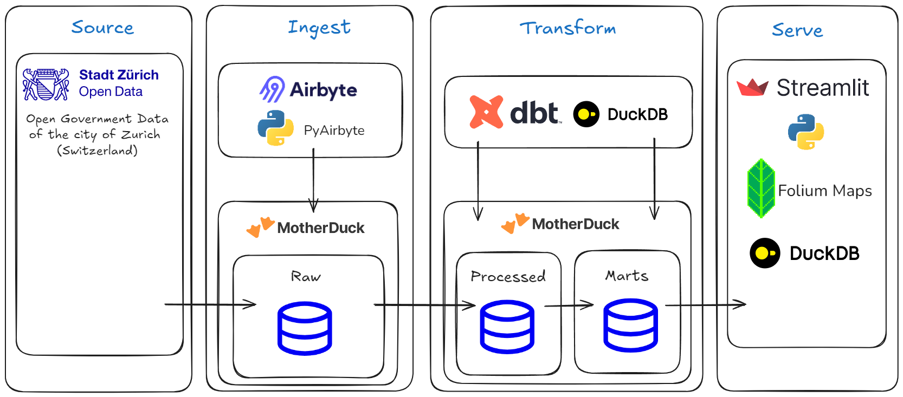

[](https://github.com/astral-sh/ruff)
[](https://github.com/pre-commit/pre-commit)


zurich local map
================

This app was created for the [Airbyte + Motherduck Hackathon](https://airbyte.com/hackathon-airbytemotherduck). It uses Open Government Data (OGD) of the city of Zurich, Switzerland: [Open Data Zurich](https://data.stadt-zuerich.ch/).

The Streamlit app is available here: [https://zurichlocal.streamlit.app/](https://zurichlocal.streamlit.app/)


## Stack



1. Data is loaded from the City of Zurich Open Data API into the "raw" schema on Motherduck. The Airbyte API Connection was built in the Airbyte UI and exported to YAML. Mothderduck is accessed using the new Airbyte Motherduck connector. The ingestion is run through PyAirbyte.
2. The data is transformed using DBT and DuckDB. Several custom DBT macros process the raw data. The final marts schema combines the processed sources into a star schema.
3. Data from the marts schema is loaded into a Streamlit dashboard using duckdb and python. It is then display on a folium map.


## ToDo

1. Testing - Test data for correctness and completeness, test pipelines, test dashboard.
2. Orchestration - e.g. use Dagster to schedule and run the data ingesition and transformation pipelines.
3. CI/CD - use github actions to build container images of the data pipeline and the serving stage. Deploy them to an appropriate service.

## Installation

* Install python 3.11 e.g. using [pyenv](https://github.com/pyenv/pyenv)
* [Install poetry](https://python-poetry.org/docs/#installation)
* [Install Docker](https://docs.docker.com/get-started/get-docker/)

In the project dir run

```bash
$ poetry install --no-root
```

## Usage

1. Create a Motherduck account and database. Copy your access token from the settings.

2. Create a .env file in the project root and set MD_ACCESS_TOKEN=\<your token\>

3. Run Airbyte import to your Motherduck instance:

```bash
$ python src/ingest/ingest_data.py
```

4. Run DBT transformations on Motherduck


```bash
$ python src/transform/dbt_runner.py
```

5. Run the streamlit dashboard

```bash
$ python -m streamlit run src/dashboard/app.py
```
